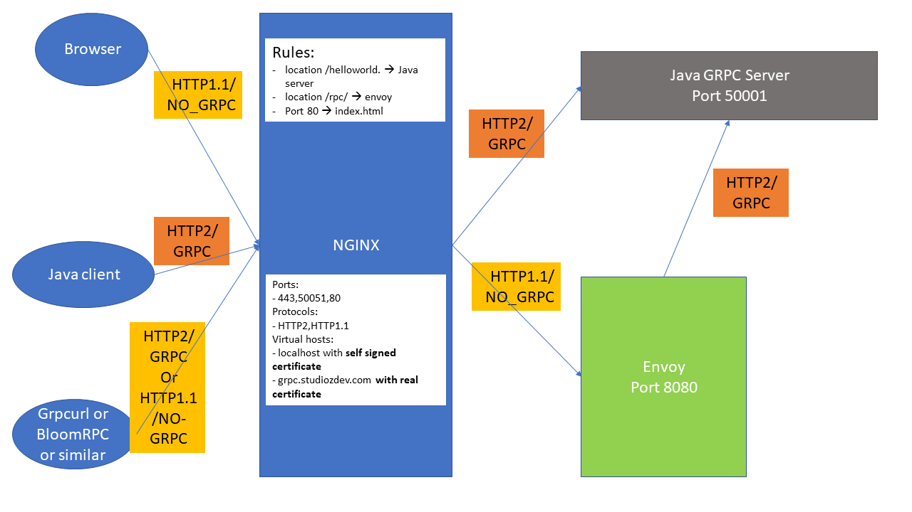
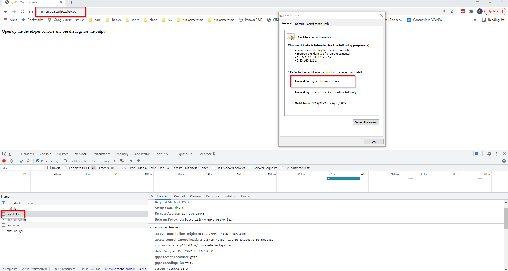
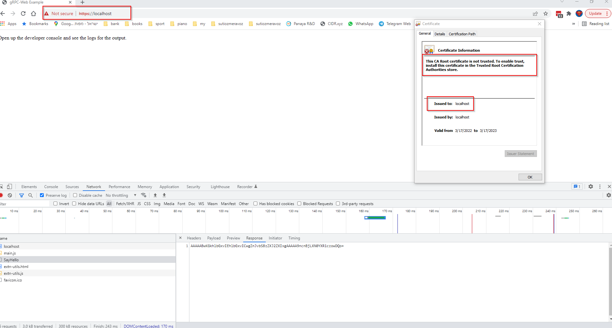

# grpc-web-demo
### Example project to demonstrate grpc server architecture using Nginx+Envoy as reverse proxies
This demo project is for demonstrating how to run grpc server with Nginx+Envoy in docker-compose together with browser and regular clients

### Preparation for this demo
To make this demo work properly, besides installing Docker and docker-compose, we need to have 2 more crucial things:
* Edit the file 'c:\Windows\System32\drivers\etc\hosts' on Windows or '/etc/hosts' on Linux with following line
    * 127.0.0.1 grpc.studiozdev.com
    * This will simulate our local computer as serving this domain
* Get/generate a real authorized HTTPS certificates for the domain "grpc.studiozdev.com" and generate a selfsigned certificate for localhost
    * After being generated or fetched, it should be places under the directory "nginx/ssl" in 'certs' and 'private' directories for public and private certificates respectively

### build and run
just run:
```bash
docker-compose up --build -d
```
After to wath th logs continuously, run
```bash
docker-compose logs -f
```

### Components


Since at the moments, browsers does not support GRPC, we must use the Envoy proxy for that:


### grpcurl commands
#### grpc.studiozdev.com

Call server with plaintext (NO HTTPS)
```bash
grpcurl  -plaintext -d '{"name": "103"}' grpc.studiozdev.com:50051 helloworld.Greeter/SayHello
```
Call server with encryption
```bash
grpcurl  -d '{"name": "103"}' grpc.studiozdev.com:443 helloworld.Greeter/SayHello
```

#### localhost with self signed certificate

Call server with plaintext (NO HTTPS)
```bash
grpcurl  -plaintext -d '{"name": "103"}' localhost:50051 helloworld.Greeter/SayHello
```
Call server with encryption
```bash
grpcurl  -d '{"name": "103"}' localhost:443 helloworld.Greeter/SayHello
#output:
Failed to dial target host "localhost:443": x509: certificate relies on legacy Common Name field, use SANs or temporarily enable Common Name matching with GODEBUG=x509ignoreCN=0
#The following works with -insecure flag:
grpcurl -insecure  -d '{"name": "103"}' localhost:443 helloworld.Greeter/SayHello
```

###java client commands
####grpc.studiozdev.com

Call server with plaintext (NO HTTPS)
```bash
docker-compose run -e USE_PLAINTEXT=true -e PORT=50051 -e HOSTNAME=grpc.studiozdev.com client  
```
Call server with encryption
```bash
docker-compose run -e USE_PLAINTEXT=false -e PORT=443 -e HOSTNAME=grpc.studiozdev.com client
```

#### localhost with self signed certificate

Call server with plaintext (NO HTTPS)
```bash
docker-compose run -e USE_PLAINTEXT=true -e PORT=50051 -e HOSTNAME=localhost client
```
Call server with encryption
```bash
docker-compose run -e USE_PLAINTEXT=false -e PORT=443 -e HOSTNAME=localhost client
#output:
WARNING: RPC failed: Status{code=UNAVAILABLE, description=io exception, cause=io.netty.channel.AbstractChannel$AnnotatedConnectException: Connection refused: localhost/0:0:0:0:0:0:0:1:443
Caused by: java.net.ConnectException: Connection refused
```


#### From browser
Open your browser in [https://grpc.studiozdev.com], open Devtools (F12),  see screenshot and watch logs:

To test it with localhost with selfsigned certificate, open in [https://localhost:443].
We can see it still works because we don't use GRPC from the browser but the browser will complain about that the certificate is not valid, see screenshot:


#### From BloomRPC
Install From [bloomrpc](https://github.com/bloomrpc/bloomrpc). This tool allows us to simulate both GRPC and web calls.
After importing the "base/helloworld.proto" file, you can start testing the following scenarios: 
* domain grpc.studiozdev.com
  * WEB with domain grpc.studiozdev.com no TLS, port 50051 [bloom_web_studiozdev_plaintext](/bloom_web_studiozdev_plaintext.png)
  * GRPC with domain grpc.studiozdev.com no TLS, port 50051 [bloom_grpc_studiozdev_plaintext](/bloom_grpc_studiozdev_plaintext.png)
  * GRPC With domain grpc.studiozdev.com with TLS, port 443, we will need to tell it where is the certificate [bloom_grpc_studiozdev_tls - 1](/bloom_grpc_studiozdev_tls-a.png) and [bloom_grpc_studiozdev_tls - 2](/bloom_grpc_studiozdev_tls-b.png)
* domain localhost
  * WEB with domain localhost no TLS, port 50051 [bloom_web_localhost_plaintext](/bloom_web_localhost_plaintext.png)    
  * GRPC with domain localhost no TLS, port 50051 [bloom_grpc_studiozdev_plaintext](/bloom_grpc_localhost_plaintext.png)
  * GRPC With domain localhost with TLS, port 443, we will need to tell it where is the certificate [bloom_grpc_localhost_tls_with_server_certificate - 1](/bloom_grpc_localhost_tls_with_server_certificate.png) and [bloom_grpc_localhost_tls_with_server_certificate - 2](/bloom_grpc_localhost_tls_with_server_certificate-b.png)
    *  After importing the certificate, it will work: [bloom_grpv_localhost_import_cert](/bloom_grpc_localhost_tls_with_import_cert.png) [bloom_grpv_localhost_import_cert - 2](/bloom_grpc_localhost_tls_with_import_cert.png)
